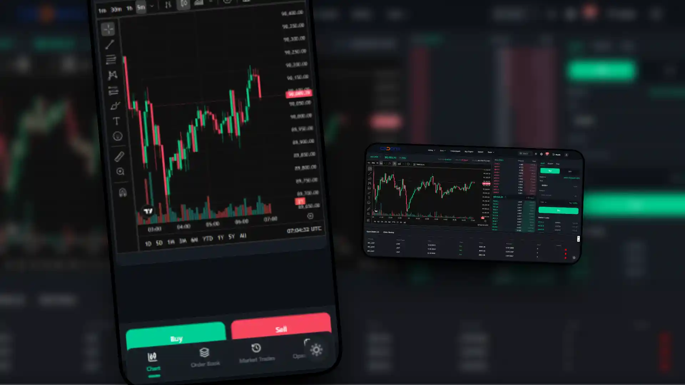
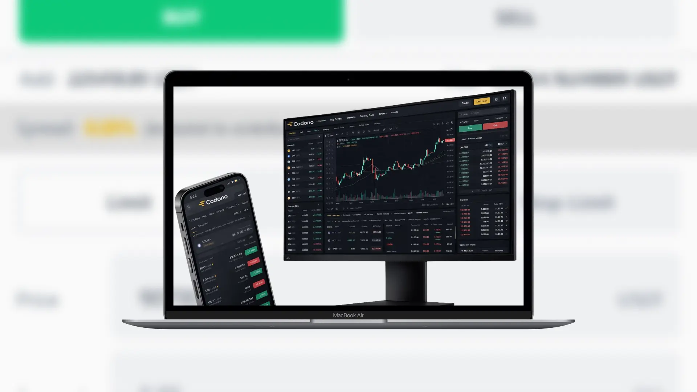
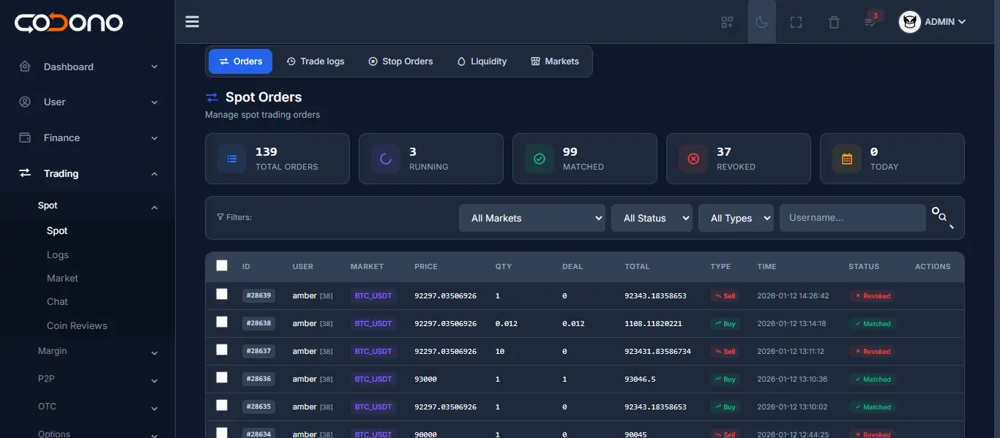
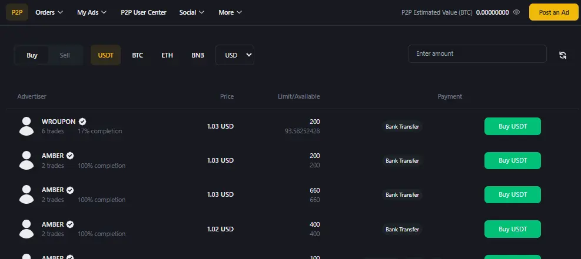
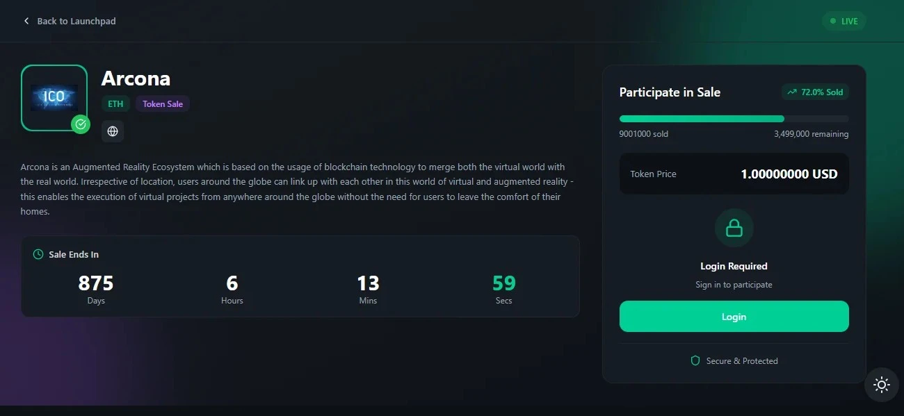

<<<<<<< HEAD
# Cryptocurrency Exchange Script | Binance Clone | White Label Exchange

[](https://github.com/CodonoTeam/cryptocurrency-exchange-script/stargazers)
[](https://codono.com/pricing/)
[](changelog.md)
[](https://php.net)
[](https://demo.codono.com)

<p align="center">
  
</p>

**Launch your own cryptocurrency exchange in days, not months.** Codono is a complete, battle-tested exchange solution with 6+ years of development, trusted by exchanges worldwide.

<!-- Keywords for GitHub Search -->
<!-- cryptocurrency exchange script, binance clone, crypto exchange software, white label exchange, bitcoin trading platform, ethereum exchange, P2P trading platform, ICO launchpad, crypto wallet, trading bot API, perpetual futures, margin trading, forex trading, NFT marketplace -->

---

## Table of Contents

- [Premium Trading Modules](#-premium-trading-modules)
- [Quick Start](#-quick-start)
- [Screenshots](#-screenshots)
- [Core Features](#-core-features)
- [Admin Panel](#-admin-panel)
- [Supported Blockchains](#-supported-blockchains)
- [Documentation](#-documentation)
- [Why Codono?](#-why-codono)
- [FAQ](#-faq)
- [Support](#-support)

---

## NEW Premium Trading Modules

### Perpetual Futures Trading
Trade crypto with up to **125x leverage**. Enterprise-grade derivatives platform:
- Cross & Isolated margin modes
- Mark price aggregated from 6 exchanges (manipulation resistant)
- Real-time funding rate calculations
- Auto-deleveraging (ADL) system
- Liquidation engine with insurance fund
- WebSocket real-time order updates

<p align="center">
  
</p>

### Margin Trading (Isolated)
Leveraged spot trading with advanced risk management:
- Up to **20x leverage** per market
- Isolated margin positions
- Auto-liquidation at maintenance margin
- Loan interest calculations
- Real-time P&L tracking
- Position management dashboard

<p align="center">
  
</p>

### Forex Trading
Professional forex trading module:
- **100+ currency pairs** (majors, minors, exotics)
- Up to **100x leverage**
- Real-time quotes from multiple providers
- Configurable spread management
- Multi-currency account support
- TradingView charts integration

### NFT Marketplace
Full-featured NFT trading platform:
- Create, mint, buy, sell NFTs
- Auction system with live bidding
- Multi-chain support (Ethereum, BSC, Polygon)
- Creator royalty management
- Collection & gallery management
- Lazy minting support

---

## Trading Modules Comparison

| Module | Leverage | Settlement | Key Features |
|--------|----------|------------|--------------|
| **Spot Trading** | 1x | Instant | Classic & Pro UI, real-time orderbook |
| **Margin Trading** | Up to 20x | T+0 | Isolated positions, auto-liquidation |
| **Perpetual Futures** | Up to 125x | Perpetual | Cross/Isolated margin, funding rates |
| **Forex Trading** | Up to 100x | Real-time | 100+ pairs, spread management |
| **P2P Trading** | 1x | Escrow | Peer-to-peer, multiple payment methods |
| **NFT Marketplace** | - | Blockchain | Multi-chain, auctions, royalties |

---

## Quick Start

Get your exchange running in 5 steps:

```
1. Download    ➜  Get the Codono Kit from codono.com/download
2. Install     ➜  Follow automatic setup guide (docs/oneinstack_setup/)
3. Configure   ➜  Set up coins via Admin Panel (manage/coins.md)
4. Add Markets ➜  Create trading pairs (manage/market.md)
5. Launch      ➜  Your exchange is live!
```

**Average setup time: 30 minutes**

[**Download Free Kit**](https://codono.com/download/) | [**View Live Demo**](https://demo.codono.com) | [**Setup Guide**](docs/oneinstack_setup/README.md)

---

## Screenshots

| Spot Trading | Admin Dashboard | Mobile App |
|:------------:|:---------------:|:----------:|
|  |  |  |

| P2P Trading | Launchpad (ICO/IEO) | Margin Trading |
|:-----------:|:-------------------:|:--------------:|
|  |  |  |

---

## Core Features

| Feature | Description |
|---------|-------------|
| **Spot Trading** | Classic & Pro interfaces with real-time orderbook |
| **P2P Trading** | Peer-to-peer with escrow protection |
| **OTC Desk** | Large volume trades off-orderbook |
| **ICO/IEO Launchpad** | Token sale platform with allocation system |
| **Staking** | Flexible & locked staking with rewards |
| **Mining Module** | Cloud mining with reward distribution |
| **NFT Marketplace** | Create, buy, sell, auction NFTs |
| **Mobile App** | iOS & Android native apps (Ionic) |
| **Easy Trade** | Simplified buy/sell for beginners |
| **Voting** | Community token listing votes |
| **Airdrop** | Token distribution campaigns |
| **Faucet** | Free token claims for engagement |
| **Leaderboard** | Trading competitions & rankings |
| **API Integration** | Full REST API for trading bots |

[View All Features](https://codono.com/features/)

---

## Admin Panel

Full control over your exchange from a powerful admin dashboard:

<p align="center">
  
</p>

### User Management
- KYC verification & document review
- Account status control (active/suspended/banned)
- Balance adjustments & transaction history
- User activity logs & security monitoring

### Trading Configuration
- [**Add/Edit Coins**](manage/coins.md) - Configure any cryptocurrency
- [**Market Pairs**](manage/market.md) - Set up trading pairs with custom fees
- [**Staking Plans**](manage/staking.md) - Create investment products
- [**Launchpad**](manage/launchpad.md) - Host ICO/IEO token sales
- [**Airdrop**](manage/airdrop.md) - Distribute tokens to users
- [**Mining**](manage/mining.md) - Configure mining rewards
- [**Competition**](manage/competition.md) - Trading competitions

### Revenue Management
- Trading fee configuration per market
- Withdrawal fee settings per coin
- Referral bonus tiers (3 levels)
- Fee collection to designated accounts

### Security Controls
- 2FA enforcement settings
- IP whitelisting
- Login attempt limits
- Withdrawal approval workflow
- Anti-fraud monitoring

[**Full Admin Documentation**](manage/README.md)

---

## Supported Blockchains

### Native Integrations

| Blockchain | Tokens | Notes |
|------------|--------|-------|
| **Bitcoin** | BTC, BCH, LTC, DOGE, DASH, ZCASH | Full node support |
| **Ethereum & EVM** | ERC20, BEP20, FTM20, AVAX, Polygon | All EVM chains via [chainlist.org](https://chainlist.org) |
| **TRON** | TRX, TRC20, TRC10 | Pro & Ultra editions |
| **Ripple** | XRP | Native integration |
| **Monero** | XMR, Cryptonote coins | Privacy coins |
| **Polkadot** | DOT, Substrate tokens | Ecosystem support |
| **Waves** | WAVES, Waves tokens | Full integration |
| **Nexa** | NEXA, Nexa tokens | Native support |

### Third-Party Integrations

| Provider | Coins Supported | Use Case |
|----------|-----------------|----------|
| [**CoinPayments**](https://coinpayments.net) | 2000+ | Multi-coin gateway |
| [**Blockgum**](docs/blockgum-integration.md) | All EVM chains | Cross-chain wallet |
| [**CryptoApis.io**](docs/cryptoapis.io.setup.md) | Multiple | API-based integration |
| **Block.io** | BTC, LTC, DOGE | Simple integration |

### Fiat Gateways

| Gateway | Regions | Features |
|---------|---------|----------|
| **Bank Deposit** | Global | Manual verification |
| **Authorize.net** | US/Canada | Credit card processing |
| **YocoPayments** | South Africa | Local payments |
| **Mobile Money** | Africa | M-Pesa, MTN, etc. |

*Custom fiat gateway integration available upon request*

---

## Documentation

### Setup Guides
- [**Automatic Setup (Recommended)**](docs/oneinstack_setup/README.md)
- [Manual Exchange Setup](docs/exchange-setup.md)
- [How Does Codono Work](docs/how-does-codono-work.md)
- [Multi-Server Setup](docs/multi_server/README.md)

### Blockchain Setup
- [BEP20 Token Setup](docs/bep20-setup.md)
- [TRC20 Token Setup](docs/trc20-setup.md)
- [TRON Setup](docs/tron_setup.md)
- [XRP Setup](docs/xrp-setup-crypto-exchange.md)
- [Ethereum (Geth)](docs/geth-codono-working.md)
- [Polkadot/Substrate](docs/substrate-node-solution.md)
- [All Node Setups](node-setup/)

### Integrations
- [Blockgum Integration](docs/blockgum-integration.md)
- [CryptoApis.io Setup](docs/cryptoapis.io.setup.md)
- [Binance Cross Trading](docs/binance-cross-trading-setup.md)
- [WebSocket & Liquidity](docs/WebSocketConfigLiquidity.md)
- [Google Login Setup](docs/google-login-setup.md)
- [Shuftipro KYC](docs/shuftipro-setup-requirements.md)

### Security
- [Security Best Practices](docs/security-tips.md)
- [Must-Follow Security](docs/must-follow-security.md)
- [Things to Avoid](docs/things-to-avoid.md)

---

## Why Codono?

| Feature | Codono | Competitors |
|---------|--------|-------------|
| **Source Code** | Full access | Encrypted/Obfuscated |
| **Customization** | Unlimited | Limited |
| **Supported Coins** | 2000+ | 10-50 |
| **Mobile App** | Included | Extra cost |
| **P2P Trading** | Included | Extra cost |
| **Futures Trading** | Included | Extra cost |
| **Margin Trading** | Included | Extra cost |
| **NFT Marketplace** | Included | Extra cost |
| **Payment Model** | One-time | Monthly subscription |
| **Updates** | 1 year included | Extra cost |
| **Support** | Telegram + Live Chat | Email only |

### 6+ Years of Development
- Battle-tested in production environments
- Regular security updates
- Continuous feature additions
- Active developer community

---

## FAQ

<details>
<summary><b>What programming languages is Codono built with?</b></summary>

- **Backend:** PHP 7.4+ (ThinkPHP framework)
- **Frontend:** Vue.js 3
- **Mobile App:** Ionic/Angular
- **Trading Engine:** Node.js (TypeScript)
- **Database:** MySQL, Redis, QuestDB (for time-series)
</details>

<details>
<summary><b>Do I need to run blockchain nodes?</b></summary>

No, running your own nodes is optional. You can use third-party services like:
- **Blockgum** - For all EVM chains
- **CoinPayments** - For 2000+ coins
- **CryptoApis.io** - API-based integration

However, running your own nodes gives you more control and lower fees.
</details>

<details>
<summary><b>Is there a live demo I can try?</b></summary>

Yes! Visit [demo.codono.com](https://demo.codono.com) to test all features including:
- Spot trading
- P2P marketplace
- Wallet functions
- Admin panel (request access)
</details>

<details>
<summary><b>What's included in the license?</b></summary>

- Full source code access
- 1 year of updates
- Installation support
- Documentation access
- Telegram community support
- Single domain license (multi-domain available)
</details>

<details>
<summary><b>Can I customize the design?</b></summary>

Yes, completely! You get full source code access, so you can:
- Change colors, logos, branding
- Modify UI components
- Add new features
- Integrate with other systems
</details>

<details>
<summary><b>What about regulatory compliance?</b></summary>

Codono includes:
- KYC/AML integration (Shuftipro, SumSub)
- Transaction monitoring
- Withdrawal limits
- IP-based restrictions
- Audit logs

You're responsible for compliance with local regulations.
</details>

---

## Support

<p align="center">
  <a href="https://t.me/ctoninja">
    
  </a>
  <a href="https://codono.com">
    
  </a>
  <a href="https://codono.com/contact">
    
  </a>
</p>

---

## Ready to Launch Your Exchange?

<p align="center">
  <a href="https://codono.com/download/">
    
  </a>
  <a href="https://demo.codono.com">
    
  </a>
  <a href="https://codono.com/pricing/">
    
  </a>
</p>

---

<p align="center">
  <sub>Built with dedication by the Codono Team | <a href="https://codono.com">codono.com</a></sub>
</p>
=======

## Discover the Power of Codono's Cryptocurrency Exchange Script


Experience a Revolution in Crypto Trading with Codono's [Cryptocurrency Exchange Script](https://codono.com)

Unveil the Future of Crypto Trading

- **Auto Detection of Deposits:** Enjoy the seamless detection and instant crediting of deposits. Each user is assigned a unique deposit per coin, ensuring accuracy and efficiency.

- **Binance Clone:** Leverage the power of Codono's Binance clone to create cryptocurrency exchanges akin to Binance, Huobi, and Coinbase. Begin your crypto exchange journey within a week.


Explore the Universe of [Binance Clone](https://codono.com)

- **Asset Trading Solution:** Trade a diverse array of assets including cryptocurrencies, tokens, and fiats. Benefit from market-making and liquidity options for enhanced trading experiences.

- **Fiat-Crypto Market:** Codono supports all fiat currencies, allowing you to establish markets between Fiat-Crypto, Fiat-Fiat, and Crypto-Crypto pairs.

- **Wide Token Compatibility:** Enjoy compatibility with numerous coins and tokens, from Bitcoin (BTC), Litecoin (LTC), Dogecoin (DOGE), Tron [TRC10+TRC20]*, Ethereum based tokens [ETH-ERC20, BNB-BEP20, FTM, SOL, Private Networks], XRP, XMR, Waves, Coinpayments, and more.

[Cryptocurrency Nodes Setup Guide](node-setup/) for codono


Elevate Your Trading with [Cryptocurrency Exchange Software](https://codono.com/download/)

- **6 Years of Expertise:** Codono's Binance clone has evolved over 6 years, making it suitable for businesses of all scales, from small startups to enterprise giants.

- **Web and Mobile App Deployment:** Access the world of crypto trading seamlessly through web and mobile applications, ensuring a user-friendly experience.

### Documentation for cryptocurrency exchange
- [Codono Setup fully automatic method](docs/oneinstack_setup/README.md)
- [How Does Codono Work](docs/how-does-codono-work.md)
- [WebSocketConfigLiquidity](docs/WebSocketConfigLiquidity.md)
- [PHP Dex Decentralized Exchange](docs/php-dex-decentalized-exchange.md)
- [BEP20 Setup](docs/bep20-setup.md)
- [Security Tips](docs/security-tips.md)
- [Binance Cross Trading Setup](docs/binance-cross-trading-setup.md)
- [Shuftipro Setup Requirements](docs/shuftipro-setup-requirements.md)
- [Blockgum Integration](docs/blockgum-integration.md)
- [Substrate Node Solution](docs/substrate-node-solution.md)
- [BNB Client Info](docs/bnb_client_info.md)
- [Things to Avoid](docs/things-to-avoid.md)
- [Cryptoapis.io Setup](docs/cryptoapis.io.setup.md)
- [TRC20 Setup](docs/trc20-setup.md)
- [Exchange Setup Manually](docs/exchange-setup.md)
- [Tron Setup](docs/tron_setup.md)
- [Google Login Setup](docs/google-login-setup.md)
- [XRP Setup for Crypto Exchange](docs/xrp-setup-crypto-exchange.md)

## White Label Blockchain Solution: Elevate Your Crypto Business with Codono

If you're on the hunt for a white-label blockchain solution provider, look no further than Codono. With their turn-key solutions, crypto business owners can quickly establish their presence and operations. Codono offers unparalleled service offerings that cater to your every need. Their unique white label solutions are built on proven frameworks, ensuring reliability and adaptability.

### Crypto Exchange Script: Unveiling a World of Possibilities

The Crypto Exchange Script, a cutting-edge white label blockchain solution, stands as an open-source software masterpiece. Liberated from the grasp of centralized entities, it presents a world of limitless possibilities. Its codebase, openly accessible and globally tested, is a testament to its robustness. The innovative minds at Codono, a leading Blockchain software development company, have crafted a secure and adaptable white label version. This version empowers developers to seamlessly deploy and customize cryptocurrency exchange services.

**Why Choose Codono's Crypto Exchange Script?**

- **Freedom and Flexibility:** Embrace the liberty of an open-source solution that is not bound by constraints. Customize, modify, and innovate to your heart's content.
  
- **Security First:** Rest assured with a software solution built on blockchain technology, fortified against vulnerabilities and threats.

- **Global Validation:** With its codebase tested and approved by developers worldwide, you're in the company of a robust and credible solution.

- **Partnered Excellence:** Codono collaborates with Blockgum, a leading Blockchain software development company, ensuring you benefit from a wealth of expertise.

- **Commercial Licensing:** Embrace the assurance of a software licensed under the Commercial License, delivering legality and peace of mind.

### Harness the Power of Codono's White Label Blockchain Solution

Elevate your crypto business, forge your unique path, and experience the freedom to innovate with Codono's exceptional white-label blockchain solution. Partner with a trusted name that places your success at the forefront.

For more information, visit [Codono's official website](https://codono.com).

Discover your potential, redefine possibilities – Codono's White Label Blockchain Solution.


## Crypto Exchange Script: Empowering Your Exchange Platform

The Crypto Exchange Script is a versatile solution for building a comprehensive cryptocurrency exchange platform. It functions as a dynamic software development kit that integrates both public and private libraries, allowing for the seamless development of a cryptocurrency exchange. Built on blockchain technology and offered as an open-source platform, the Crypto Exchange Script empowers businesses to create their own private and white-label exchange solutions that cater to their specific customer base.

### Key Features and Benefits:

- **Customizable Backend and User Interface:** The Crypto Exchange Script provides a fully customizable backend infrastructure and a user-friendly interface. Its administration panel empowers platform administrators to efficiently manage operations and activities.

- **Multi-Level Referral Systems:** The platform supports multi-level referral systems, enhancing user engagement and incentivizing growth within the exchange ecosystem.

- **Double-Entry Accounting:** With double-entry accounting, financial transactions are accurately recorded and managed, ensuring transparency and accuracy in the exchange's financial operations.

- **API Key Integration for Trading Bots:** Trading bots can be seamlessly integrated using API keys, enabling automated trading strategies and enhancing liquidity.

- **Trusted by Industry Leaders:** The Crypto Exchange Script enjoys a strong reputation and is trusted by prominent players in the financial industry.

### Comprehensive Feature Set:[Exchange Script](https://codono.com/features/)

1. **Spot Classic:** Trade a variety of cryptocurrencies in real-time with basic trading features.
2. **Spot Pro:** Advanced trading platform with tools for professional traders.
3. **OTC:** Trade large volumes directly between users, avoiding public order books.
4. **Easy Trade:** User-friendly interface for newcomers to navigate and execute trades.
5. **FX Quote [Xe API]:** Real-time foreign exchange rates for crypto-to-fiat conversions.
6. **Voting:** Empower your community with coin voting for new token listings.
7. **Listing Competition:** Engage users through listing competitions for new tokens.
8. **P2P Trading:** Enable peer-to-peer trading with customizable terms.
9. **ICO / IEO Launchpad:** Launch token offerings, providing users exclusive access.
10. **Store:** Shop with cryptocurrencies, expanding their utility.
11. **Airdrop:** Distribute free tokens for marketing campaigns.
12. **Faucet:** Users can claim free tokens to encourage engagement.
13. **Staking / Invest:** Stake cryptocurrencies for rewards or invest in assets.
14. **Mining Module:** Enable cryptocurrency mining with rewards.
15. **Dex Sell [Metamask]:** Integrate DEX for token trading via Metamask wallets.
16. **LeaderBoard** Leaderboard is a dynamic feature designed to enhance user engagement and foster a competitive spirit among the users of our platform.[Leaderboard](features/leaderboard.md)
17. **All Standard Features:** User registration, security (2FA, recaptcha), order book, trade history, real-time price charts, and more.

### Whitelabel Crypto Exchange Script: A Swift Path to Market

The Whitelabel Crypto Exchange Script platform offers a turnkey solution for launching a white-label cryptocurrency exchange with exceptional speed-to-market. The platform ensures that users retain control of their private keys, promoting a non-custodial approach to security. Cost-effective and boasting a customizable user interface, the front-end of the Crypto Exchange Script has been optimized for enhanced search visibility and SEO performance.

### High-Performance and Ready for Diverse Tokens

Built on a go-based implementation, the Crypto Exchange Script delivers high-performance trading functionality. The platform is capable of hosting more than 2000 cryptocurrencies and tokens, offering users a diverse range of trading options.

### Unparalleled Compliance and Security

The Crypto Exchange Script is aligned with the latest regulatory guidelines, facilitating easy adaptation to changing rules. The platform's foundation on smart contracts empowers it to efficiently implement compliance changes across the system, safeguarding against fraud and undesirable activities.

### Seamless Integration and Collaboration

Codono's white label blockchain solution is designed to integrate seamlessly with various systems and networks. This flexibility allows for smooth integration into the client's existing environment, enhancing interoperability.

Experience the Future of Cryptocurrency Exchange with Codono's Innovative Solutions.

> "Codono is not just a platform; it's a revolution in the way we approach cryptocurrency exchange development. Join us as we redefine the possibilities of the blockchain ecosystem."


Here's a list of additional wallet features and integrated nodes, along with supported cryptocurrencies and fiat gateways:

**Integrated Nodes:**

1. **BTC Type [BTC, BCH, LTC, DOGE, DASH, ZCASH, PivX, etc]:** Support for various Bitcoin-type cryptocurrencies including Bitcoin, Bitcoin Cash, Litecoin, Dogecoin, Dash, Zcash, PivX, and more.

2. **ALL EVM CHAINS [ERC20/BEP20/FTM20/AVAX20]:** Integration with All EVM networks and support for all standard ERC20 tokens built on the EVM blockchain. See [chainlist](https://chainlist.org/) to see complete list of supported evm chains.

3. **TRX TRC20/TRC10:** Support for TRON's TRC20 and TRC10 tokens, available with the Pro and Ultra editions.

4. **XMR and Cryptonote:** Support for Monero (XMR) and other cryptocurrencies using the Cryptonote protocol.

5. **Block.io:** Integration with Block.io

6. **XRP:** Integration with the Ripple (XRP) blockchain, allowing users to hold and trade XRP.

7. **CoinPayments [2000+ Coins and Tokens]:** Integration with CoinPayments to support over 2000+ cryptocurrencies and tokens.

8. **Waves and Tokens:** Integration with the Waves blockchain and support for tokens created on the Waves platform.
   
9. **Blockgum Integration:** Integration with [Blockgum](https://codono.com) Node for enhanced functionality for All EVM chains and Cross chain wallet.

10. **Polkadot:** Support for the Polkadot blockchain ecosystem.

11. **Nexa Chain and Tokens:** Integration with Nexa Chain and support for its native tokens.

12. **CryptoApis.io:** Integration with Cryptoapis.io

    
**Fiat Gateways:**

1. **Bank Deposit:** Allow users to deposit funds directly from their bank accounts.

2. **Authorize.net:** Integration with the Authorize.net payment gateway for fiat transactions.

3. **YocoPayments:** Support for YocoPayments as a payment gateway for fiat transactions.

4. **Uganda Mobile Payments:** Integration with mobile payment methods popular in Uganda.

These additional wallet features and integrated nodes expand the range of cryptocurrencies and payment methods your platform can support, providing users with a diverse and comprehensive trading and payment experience.
We can add any Crypto method or Fiat gateway to Exchange software

## Expanding Possibilities with Integrated Wallet Features and Nodes

Enhance your cryptocurrency exchange platform's capabilities with the integrated wallet features and nodes offered by Codono. These additions broaden the range of supported cryptocurrencies and payment methods, providing your users with a comprehensive trading and payment experience. Our flexible solution allows seamless integration of various crypto methods and fiat gateways into your exchange software, giving you the power to cater to a diverse user base.

## Codono's White-Label Blockchain Solution: Leveraging Innovation

Codono's white-label blockchain solution empowers financial institutions and businesses to harness cutting-edge technology and create compliant digital asset ecosystems. Our end-to-end products streamline tokenization of traditional assets and significantly reduce administrative overhead by up to 70%. Leveraging an automated compliance engine, Codono ensures minimal fees and swift transaction speeds comparable to modern centralized applications.

### Advantages of Codono's White-Label Blockchain Solution

Codono's compliance infrastructure is underpinned by advanced protocols, enabling institutions to conduct secure and compliant operations. Our solution offers:

- Streamlined compliance testing
- Staking benefits exploration
- Proven success with institutional participants
- Syndicated cover for DeFi products
- Accessible global utility

## Your Path to a Seamless Exchange

For those seeking a comprehensive white-label blockchain solution, Codono's team delivers a software kit that transcends language barriers and offers international utility. Our marketplace fosters development of plugins and KYC features, enabling tailor-made solutions for every jurisdiction.

### Quick Setup and Launch

Setting up your exchange is a breeze with Codono's user-friendly approach:

1. Choose a plan and hosting
2. Opt for hosted or cloud exchange
3. Initiate setup process
4. Customize theme and graphics
5. Launch your exchange within 30 minutes

## Codono: Empowering Startups and Businesses

Aspiring startups and established businesses find Codono an ideal white-label cryptocurrency exchange solution. It's open-source, eliminating third-party authorization hurdles. Download our exchange kit from GitHub, host it locally or via the cloud, and leverage our marketing tools for a successful entry into the crypto industry.

## Get Started with Codono

To build your exchange website, download the Codono kit for free. Customize themes and graphics to match your brand's identity. Engage with our team through Telegram or live chat to explore the full range of features and discuss any queries.

[Get Codono Kit](https://codono.com/download/)
---
<a href="https://t.me/ctoninja"></a>
<a href="https://codono.com"></a>

---
>>>>>>> origin/main
