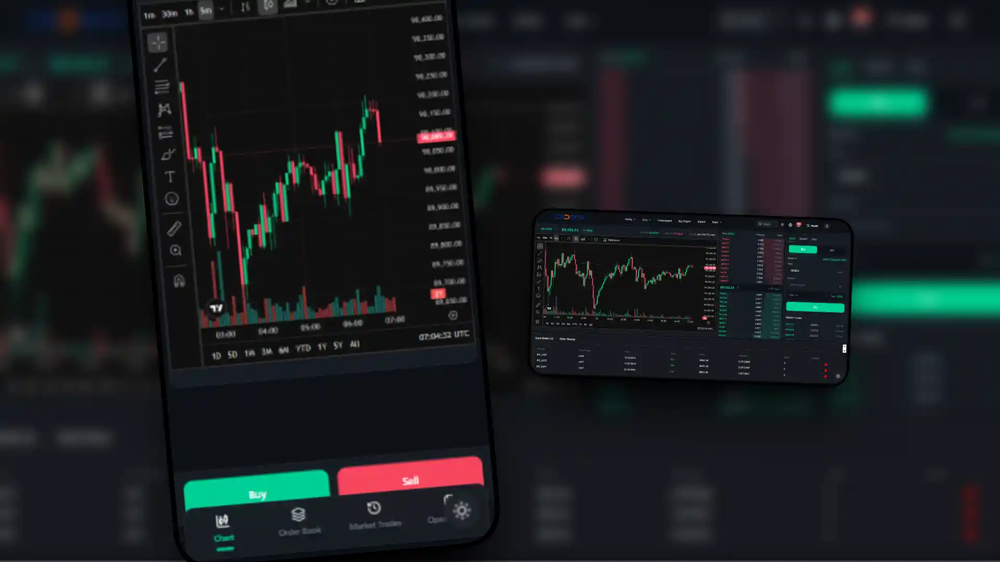
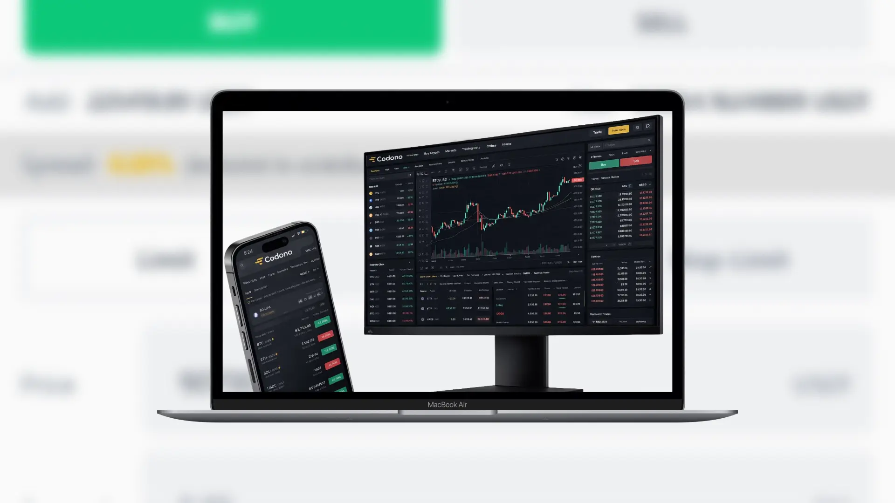
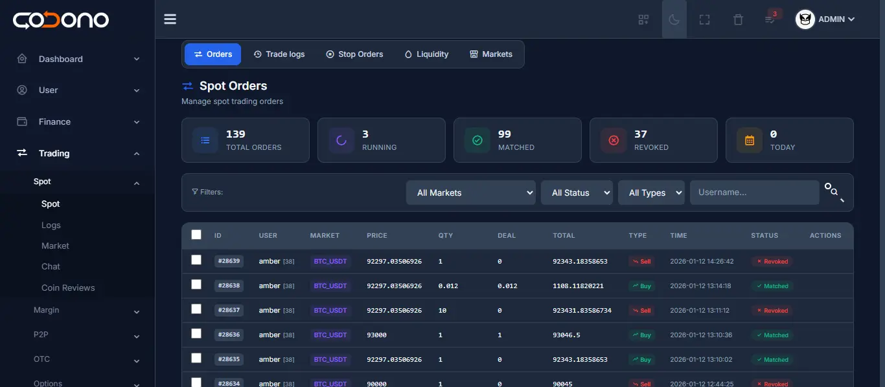
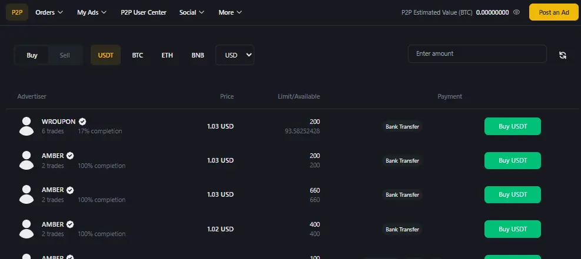
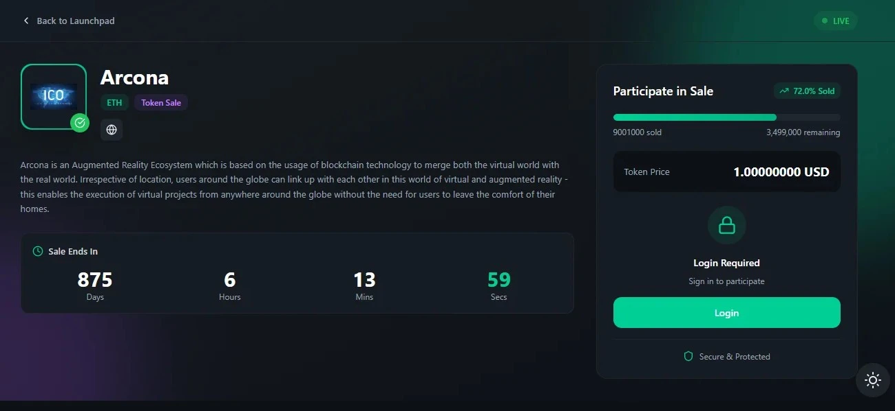

# [Crypto Exchange Software](https://codono.com/software/crypto-exchange) | [Cryptocurrency Exchange Script](https://codono.com/solutions/crypto-exchange-script) | [White Label Crypto Exchange](https://codono.com/software/white-label-crypto-exchange)

[](https://github.com/CodonoTeam/cryptocurrency-exchange-script/stargazers)
[](https://codono.com/pricing/)
[](changelog.md)
[](https://php.net)
[](https://vuejs.org)
[](https://nodejs.org)
[](https://codono.com/demo)

<p align="center">
  
</p>

**Launch your own cryptocurrency exchange in days, not months.** Codono is a complete, battle-tested [crypto exchange software](https://codono.com/software/crypto-exchange) with 7+ years of development, trusted by 500+ operators worldwide. Get **100% unencrypted source code** with a one-time license — no monthly fees, no revenue sharing.

---

## Table of Contents

- [Premium Trading Modules](#premium-trading-modules)
- [Quick Start](#quick-start)
- [Screenshots](#screenshots)
- [All Features](#all-features)
- [Admin Panel](#admin-panel)
- [Supported Blockchains (50+)](#supported-blockchains-50)
- [Documentation](#documentation)
- [Why Codono?](#why-codono)
- [FAQ](#faq)
- [Support](#support)

---

## Premium Trading Modules

### [Spot Trading Software](https://codono.com/features/spot-trading-exchange)

Professional spot trading engine built for high-throughput exchange operations:

- **100,000+ orders/second** matching engine
- 7+ order types: Limit, Market, Stop-Limit, OCO, Iceberg, Post-Only, Fill-or-Kill
- Classic & Pro trading interfaces with [TradingView charts](https://codono.com/features/charts)
- Real-time orderbook with WebSocket streaming
- Multi-language support (12 languages)

### [Futures Trading Software](https://codono.com/software/futures-trading)

Trade crypto with up to **125x leverage**. Enterprise-grade [futures trading platform](https://codono.com/solutions/futures-trading-platform):

- Cross & Isolated margin modes
- Mark price aggregated from 6 exchanges (manipulation resistant)
- Real-time funding rate calculations
- Auto-deleveraging (ADL) system
- Liquidation engine with insurance fund
- WebSocket real-time order updates

<p align="center">
  
</p>

### [Margin Trading Software](https://codono.com/features/margin-trading) (Isolated)

Leveraged spot trading with advanced risk management:

- Up to **20x leverage** per market
- Isolated margin positions
- Auto-liquidation at maintenance margin
- Loan interest calculations
- Real-time P&L tracking
- Position management dashboard

<p align="center">
  
</p>

### [Forex Trading Software](https://codono.com/software/forex-trading)

Professional forex trading module:

- **100+ currency pairs** (majors, minors, exotics)
- Up to **100x leverage**
- Real-time quotes from multiple providers
- Configurable spread management
- Multi-currency account support
- TradingView charts integration

### [P2P Crypto Exchange Software](https://codono.com/software/p2p-crypto-exchange)

Peer-to-peer trading with escrow-based settlement:

- **300+ payment methods** (bank transfer, UPI, M-Pesa, PayPal, etc.)
- Automated escrow protection
- Dispute resolution system
- Merchant verification system
- Customizable trade limits & fees

### [NFT Marketplace Software](https://codono.com/software/nft-marketplace)

Full-featured NFT trading platform:

- Create, mint, buy, sell NFTs
- Auction system with live bidding
- Multi-chain support (Ethereum, BSC, Polygon)
- Creator royalty management
- Collection & gallery management
- Lazy minting support

---

## Trading Modules Comparison

| Module | Leverage | Settlement | Key Features |
| ------ | -------- | ---------- | ------------ |
| **[Spot Trading](https://codono.com/features/spot-trading-exchange)** | 1x | Instant | Classic & Pro UI, 100K+ orders/sec matching engine |
| **[Margin Trading](https://codono.com/features/margin-trading)** | Up to 20x | T+0 | Isolated positions, auto-liquidation |
| **[Perpetual Futures](https://codono.com/software/futures-trading)** | Up to 125x | Perpetual | Cross/Isolated margin, funding rates, ADL |
| **[Forex Trading](https://codono.com/software/forex-trading)** | Up to 100x | Real-time | 100+ pairs, spread management |
| **[P2P Trading](https://codono.com/software/p2p-crypto-exchange)** | 1x | Escrow | 300+ payment methods, dispute resolution |
| **[NFT Marketplace](https://codono.com/software/nft-marketplace)** | - | Blockchain | Multi-chain, auctions, royalties |

---

## Quick Start

Get your exchange running with a single command:

```bash
# One-command setup (Ubuntu 22.04/24.04)
curl -sSL https://raw.githubusercontent.com/CodonoTeam/cryptocurrency-exchange-script/main/docs/ubuntu_setup/codono_init.sh | bash
```

Or manual setup:

```text
1. Download    ->  Get the Codono Kit from codono.com/download
2. Install     ->  Follow automatic setup guide (docs/ubuntu_setup/)
3. Configure   ->  Set up coins via Admin Panel (manage/coins.md)
4. Add Markets ->  Create trading pairs (manage/market.md)
5. Launch      ->  Your exchange is live!
```

**Average setup time: 30 minutes**

[**Download Free Kit**](https://codono.com/download/) | [**View Live Demo**](https://codono.com/demo) | [**Setup Guide**](docs/ubuntu_setup/README.md)

---

## Screenshots

| Spot Trading | Admin Dashboard | Mobile App |
| :----------: | :-------------: | :--------: |
|  |  |  |

| P2P Trading | Launchpad (ICO/IEO) | Margin Trading |
| :---------: | :-----------------: | :------------: |
|  |  |  |

---

## All Features

### Trading & Exchange

| Feature | Description |
| ------- | ----------- |
| **[Spot Trading](https://codono.com/features/spot-trading-exchange)** | Classic & Pro interfaces, 100K+ orders/sec matching engine |
| **[Margin Trading](https://codono.com/features/margin-trading)** | Up to 20x isolated leverage with auto-liquidation |
| **[Perpetual Futures](https://codono.com/software/futures-trading)** | Up to 125x leverage with cross/isolated margin |
| **[Forex Trading](https://codono.com/software/forex-trading)** | 100+ currency pairs with configurable spreads |
| **[P2P Exchange](https://codono.com/software/p2p-crypto-exchange)** | Peer-to-peer with escrow and 300+ payment methods |
| **OTC Desk** | Large volume trades off-orderbook |
| **[Liquidity Engine](https://codono.com/features/liquidity-engine)** | Deep order book aggregation from Binance & other sources |
| **Easy Trade** | Simplified buy/sell interface for beginners |

### DeFi & Yield Products

| Feature | Description |
| ------- | ----------- |
| **[Staking Platform](https://codono.com/software/staking-platform)** | Flexible & locked staking pools with configurable APR |
| **[Earn Module](https://codono.com/software/earn-module)** | Savings and yield products for passive income |
| **[Crypto Lending](https://codono.com/software/lending-software)** | Crypto-backed loans with peer-to-peer lending pools |
| **Mining Module** | Cloud mining with reward distribution |

### Token & NFT Launch

| Feature | Description |
| ------- | ----------- |
| **[Token Launchpad](https://codono.com/software/launchpad-software)** | ICO/IEO/IDO token sale platform with vesting schedules |
| **[NFT Marketplace](https://codono.com/software/nft-marketplace)** | Create, buy, sell, auction NFTs with royalties |
| **Voting** | Community token listing votes |

### Payments & Wallet

| Feature | Description |
| ------- | ----------- |
| **[Crypto Wallet](https://codono.com/software/crypto-wallet)** | Multi-chain wallet system for 50+ blockchains |
| **[Crypto Payment Gateway](https://codono.com/software/crypto-payment-gateway)** | White-label payment processor, accept 500+ cryptocurrencies |
| **Fiat Gateways** | Bank deposit, Authorize.net, YocoPayments, Mobile Money |
| **Gift Cards** | Crypto gift card creation and redemption |

### Growth & Engagement

| Feature | Description |
| ------- | ----------- |
| **[Referral & Affiliate](https://codono.com/software/referral-affiliate)** | Multi-tier commissions (up to 10 levels) |
| **Airdrop** | Token distribution campaigns with eligibility rules |
| **Faucet** | Free token claims for user acquisition |
| **Leaderboard** | Trading competitions & rankings |

### Security & Compliance

| Feature | Description |
| ------- | ----------- |
| **[KYC/AML System](https://codono.com/features/kyc-aml-system)** | Shuftipro, SumSub integration with sanctions screening |
| **[Security Suite](https://codono.com/features/security)** | 2FA, anti-phishing, DDoS protection, WAF |
| **Cold Wallet** | MPC and multi-signature custody support |
| **Withdrawal Approval** | Manual approval workflow for large withdrawals |
| **Audit Logs** | Complete admin and user activity logging |

### Platform & Integration

| Feature | Description |
| ------- | ----------- |
| **[Mobile Trading App](https://codono.com/software/mobile-trading-app)** | iOS & Android native apps (Ionic) with full source code |
| **[API Integration](https://codono.com/features/api-integration)** | REST + WebSocket APIs for trading bots |
| **[Admin Dashboard](https://codono.com/features/admin-dashboard)** | Complete exchange management panel |
| **[TradingView Charts](https://codono.com/features/charts)** | Professional charting with 100+ indicators |
| **Multi-Language** | 12 languages out of the box |

[View All Features](https://codono.com/features/)

---

## [Admin Panel](https://codono.com/features/admin-dashboard)

Full control over your exchange from a powerful [admin dashboard](https://codono.com/features/admin-dashboard):

<p align="center">
  
</p>

### User Management

- [KYC/AML verification](https://codono.com/features/kyc-aml-system) & document review
- Account status control (active/suspended/banned)
- Balance adjustments & transaction history
- User activity logs & [security](https://codono.com/features/security) monitoring

### Trading Configuration

- [**Add/Edit Coins**](manage/coins.md) - Configure any cryptocurrency
- [**Market Pairs**](manage/market.md) - Set up trading pairs with custom fees
- [**Staking Plans**](manage/staking.md) - Create investment products
- [**Launchpad**](manage/launchpad.md) - Host ICO/IEO token sales
- [**Airdrop**](manage/airdrop.md) - Distribute tokens to users
- [**Mining**](manage/mining.md) - Configure mining rewards
- [**Competition**](manage/competition.md) - Trading competitions

### Revenue Management

- Trading fee configuration per market
- Withdrawal fee settings per coin
- Referral bonus tiers (up to 10 levels)
- Fee collection to designated accounts

### [Security](https://codono.com/features/security) Controls

- 2FA enforcement settings
- IP whitelisting
- Login attempt limits
- Withdrawal approval workflow
- Anti-fraud monitoring

[**Full Admin Documentation**](manage/README.md)

---

## Supported Blockchains (50+)

### Native Integrations

| Blockchain | Tokens | Notes |
| ---------- | ------ | ----- |
| **Bitcoin** | BTC, BCH, LTC, DOGE, DASH, ZCASH | Full node support |
| **Ethereum & EVM** | ERC20, BEP20, FTM20, AVAX, Polygon, Arbitrum, Optimism | All EVM chains via [chainlist.org](https://chainlist.org) |
| **TRON** | TRX, TRC20, TRC10 | Pro & Ultra editions |
| **Solana** | SOL, SPL tokens | Native integration |
| **Ripple** | XRP | Native integration |
| **TON** | TON, Jetton tokens | Telegram ecosystem |
| **Monero** | XMR, Cryptonote coins | Privacy coins |
| **Polkadot** | DOT, Substrate tokens | Ecosystem support |
| **Waves** | WAVES, Waves tokens | Full integration |
| **Nexa** | NEXA, Nexa tokens | Native support |

### Third-Party Integrations

| Provider | Coins Supported | Use Case |
| -------- | --------------- | -------- |
| [**CoinPayments**](https://coinpayments.net) | 2000+ | Multi-coin gateway |
| [**Blockgum**](docs/blockgum-integration.md) | All EVM chains | Cross-chain wallet |
| [**CryptoApis.io**](docs/cryptoapis.io.setup.md) | Multiple | API-based integration |
| **Block.io** | BTC, LTC, DOGE | Simple integration |

### Fiat Gateways

| Gateway | Regions | Features |
| ------- | ------- | -------- |
| **Bank Deposit** | Global | Manual verification |
| **Authorize.net** | US/Canada | Credit card processing |
| **YocoPayments** | South Africa | Local payments |
| **Mobile Money** | Africa | M-Pesa, MTN, etc. |

*Custom blockchain and fiat gateway integrations available upon request*

---

## Tech Stack

| Layer | Technology |
| ----- | ---------- |
| **Backend** | PHP 8.1+ (Custom MVC framework) |
| **Frontend** | Vue.js 3 with Tailwind CSS |
| **Mobile App** | Ionic/Angular (iOS & Android) |
| **Trading Engine** | Node.js (TypeScript) |
| **Matching Engine** | 100,000+ orders/second |
| **Database** | MySQL + Redis + QuestDB (time-series) |
| **WebSocket** | Real-time orderbook, trades, tickers |
| **Charts** | TradingView integration |

---

## Documentation

### Setup Guides

- [**Automatic Setup (Recommended)**](docs/ubuntu_setup/README.md) - Ubuntu 22.04/24.04
- [Manual Exchange Setup](docs/exchange-setup.md)
- [How Does Codono Work](docs/how-does-codono-work.md)
- [Multi-Server Setup](docs/multi_server/README.md)

### Blockchain Setup

- [BEP20 Token Setup](docs/bep20-setup.md)
- [TRC20 Token Setup](docs/trc20-setup.md)
- [TRON Setup](docs/tron_setup.md)
- [XRP Setup](docs/xrp-setup-crypto-exchange.md)
- [Ethereum (Geth)](docs/geth-codono-working.md)
- [Polkadot/Substrate](docs/substrate-node-solution.md)
- [All Node Setups](node-setup/)

### Integrations

- [Blockgum Integration](docs/blockgum-integration.md)
- [CryptoApis.io Setup](docs/cryptoapis.io.setup.md)
- [Binance Cross Trading](docs/binance-cross-trading-setup.md)
- [WebSocket & Liquidity](docs/WebSocketConfigLiquidity.md) | [Liquidity Engine](https://codono.com/features/liquidity-engine)
- [Google Login Setup](docs/google-login-setup.md)
- [Shuftipro KYC](docs/shuftipro-setup-requirements.md)

### Security

- [Security Best Practices](docs/security-tips.md)
- [Must-Follow Security](docs/must-follow-security.md)
- [Things to Avoid](docs/things-to-avoid.md)

---

## Why Codono?

| Feature | Codono | Competitors |
| ------- | ------ | ----------- |
| **Source Code** | [100% unencrypted](https://codono.com/solutions/self-hosted-crypto-exchange) | Encrypted/Obfuscated |
| **Pricing** | One-time license from $3,899 | Monthly subscription + revenue share |
| **Customization** | Unlimited (full source code) | Limited or extra cost |
| **Supported Coins** | 50+ native + 2000+ via integrations | 10-50 |
| **Trading Modules** | 6 included (Spot, Margin, Futures, Forex, P2P, NFT) | Extra cost per module |
| **[Mobile App](https://codono.com/software/mobile-trading-app)** | Included with source code | Extra cost |
| **[Staking & Earn](https://codono.com/software/staking-platform)** | Included | Extra cost |
| **[Token Launchpad](https://codono.com/software/launchpad-software)** | Included | Extra cost |
| **[Crypto Lending](https://codono.com/software/lending-software)** | Included | Not available |
| **[Payment Gateway](https://codono.com/software/crypto-payment-gateway)** | Included | Not available |
| **[Referral System](https://codono.com/software/referral-affiliate)** | 10-level affiliate | Basic 1-level |
| **Updates** | 1 year included | Extra cost |
| **Support** | Telegram + Live Chat | Email only |
| **Setup Time** | 30 minutes | Days to weeks |

### 7+ Years of Development

- Battle-tested in production by 500+ operators
- Regular security updates and feature releases
- Continuous feature additions
- Active developer community on Telegram

---

## FAQ

<details>
<summary><b>What is crypto exchange software?</b></summary>

Crypto exchange software is a ready-made platform that lets you launch your own cryptocurrency exchange without building from scratch. Codono provides a complete [crypto exchange software](https://codono.com/software/crypto-exchange) solution with spot trading, futures, margin trading, P2P, wallet management, and admin panel — all with full source code access.

</details>

<details>
<summary><b>What programming languages is Codono built with?</b></summary>

- **Backend:** PHP 8.1+ (Custom MVC framework)
- **Frontend:** Vue.js 3 with Tailwind CSS
- **Mobile App:** Ionic/Angular
- **Trading Engine:** Node.js (TypeScript)
- **Database:** MySQL, Redis, QuestDB (for time-series data)

</details>

<details>
<summary><b>How much does crypto exchange software cost?</b></summary>

Codono starts at **$3,899** as a one-time license fee with no recurring monthly charges or revenue sharing. This includes all trading modules (Spot, Margin, Futures, Forex, P2P, NFT), mobile apps, admin panel, and 1 year of updates. View [pricing plans](https://codono.com/pricing/).

</details>

<details>
<summary><b>Do I need to run blockchain nodes?</b></summary>

No, running your own nodes is optional. You can use third-party services like:

- **Blockgum** - For all EVM chains
- **CoinPayments** - For 2000+ coins
- **CryptoApis.io** - API-based integration

However, running your own nodes gives you more control, better security, and lower transaction fees.

</details>

<details>
<summary><b>Do I get the full source code?</b></summary>

Yes. Codono provides **100% unencrypted source code** — backend, frontend, mobile app, trading engine, and admin panel. You can modify, customize, and rebrand everything without restrictions.

</details>

<details>
<summary><b>How long does it take to launch?</b></summary>

Most operators go live in **3 to 5 days**. The automated installer sets up everything in about 30 minutes. Additional time is spent on branding, configuring coins, setting up KYC, and testing before public launch.

</details>

<details>
<summary><b>Is there a live demo I can try?</b></summary>

Yes! Visit [codono.com/demo](https://codono.com/demo) to test all features including spot trading, futures, P2P marketplace, wallet functions, staking, and the admin panel.

</details>

<details>
<summary><b>What about regulatory compliance?</b></summary>

Codono includes built-in compliance tools:

- **KYC/AML** integration (Shuftipro, SumSub)
- Transaction monitoring and suspicious activity alerts
- Configurable withdrawal limits
- IP-based restrictions and geo-blocking
- Complete audit logs for regulatory reporting

You're responsible for compliance with local regulations in your jurisdiction.

</details>

<details>
<summary><b>What is a white label crypto exchange?</b></summary>

A [white label crypto exchange](https://codono.com/software/white-label-crypto-exchange) is a ready-made exchange platform that you can rebrand with your own logo, colors, and domain name. Codono's white label solution lets you launch a fully branded exchange in as little as 14 days with complete source code ownership.

</details>

---

## Support

<p align="center">
  <a href="https://t.me/ctoninja">
    
  </a>
  <a href="https://codono.com">
    
  </a>
  <a href="https://codono.com/contact">
    
  </a>
</p>

---

## Ready to Launch Your Exchange?

<p align="center">
  <a href="https://codono.com/download/">
    
  </a>
  <a href="https://codono.com/demo">
    
  </a>
  <a href="https://codono.com/pricing/">
    
  </a>
</p>

---

<p align="center">
  <sub>Built with dedication by the Codono Team | <a href="https://codono.com">codono.com</a></sub>
</p>
